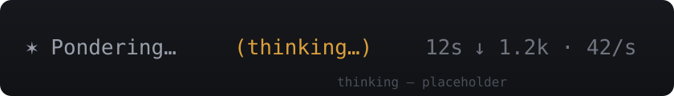
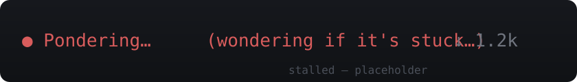

# pi-status-anim

An animated working row for the pi coding agent. While the agent streams, the
default status line is replaced with a richer, animated status: a stable verb
per phase, an animated glyph, live token counts, stall feedback, and a few
easter eggs. The whole row — verbs, glyph, tokens, timer, easter eggs, stall
feedback — lives here.

## Screenshots

Animated row in action — click to watch (placeholders until real captures are added):

<table>
  <tr>
    <td align="center">
      
      <br><em>requesting</em>
    </td>
    <td align="center">
      
      <br><em>thinking</em>
    </td>
  </tr>
  <tr>
    <td align="center">
      
      <br><em>tool</em>
    </td>
    <td align="center">
      
      <br><em>stalled</em>
    </td>
  </tr>
</table>

## Features

- **Phased verbs** — the verb changes only when the agent-loop moves between
  phases (`requesting → thinking → responding`); tool calls never change it.
- **Per-phase glyph animation** — a travelling dot while requesting, a soft
  star set while thinking/responding, braille while tools run.
- **Robot avatar** (`robotAvatar`) — instead of abstract glyphs, a 5-cell
  animated robot face across every state: it blinks while waiting, rolls its
  eyes up with a slow brain pulse while thinking, works with a fast brain
  pulse while tools run, smiles while responding, reacts to tool results
  (happy / sad for 2s, sad in red), falls asleep when stalled, and is
  pleased when done. Off by default.
- **Token counter** — the full content snapshot is recomputed on every
  update (no accumulation), shown as `↓ 1.2k` with an optional `· 42/s` rate
  and a smooth odometer.
- **Stall feedback** — no fresh tokens and no active tool for 3s: the glyph
  fades to red, the glimmer goes dark, and a tier word appears
  (worried → desperate → existential). Active tools never produce a false
  stall.
- **Liveliness** — animation speed and presence follow the real token flow.
- **Width gating** — suffix parts are dropped from the lowest priority up so
  the row never wraps, no matter how narrow the terminal.
- **Interrupt hint** — restored on the row when nothing else is shown.
- **Easter eggs** — git status, model name, time of day, fun facts after 60s
  of thinking, anxiety gradient after 60s.
- **Wave / breath** — with `animChance`, the glimmer is replaced for the
  agent-loop by a travelling light wave or a calm breathing pulse.
- **reducedMotion** — static glyph and plain text, single stall timer.

## Install

```bash
pi install <this-repository-url>
```

No runtime dependencies: the only import from the pi package is `import type`
(erased at runtime). `/reload` recreates the extension and re-reads the
config; there is no hot reload.

## Configuration

All options live in `~/.pi/agent/settings.json` under the `statusAnim` key.
Defaults are shown.

You can also configure from the TUI: `/statusanim` opens an interactive menu
of every option, and `/statusanim <key> <value>` sets one option directly
(e.g. `/statusanim robotAvatar on`). Tab completes option keys and `on|off`.
Changes are written to `settings.json`; run `/reload` to apply them.

```jsonc
{
  "statusAnim": {
    "enabled": true,
    "words": [],              // extra verbs appended to the defaults
    "intervalMs": 50,         // text-animation clock
    "showTimer": true,
    "timerAfterMs": 1000,
    "tokenCounter": true,
    "tokenAfterMs": 3000,     // when tokens appear (flicker guard)
    "tokenRate": true,        // show tok/s
    "effortSuffix": "",        // empty = auto from thinking level
    "stallAfterMs": 3000,
    "stallTiers": true,
    "modelEggs": true,
    "timeEggs": true,
    "gitStatus": true,
    "funFacts": true,
    "anxietyGradient": true,
    "reducedMotion": false,
    "toolDetail": true,       // "(grep · 247 files)" when args carry a count
    "queueHint": true,        // "(+ queued)"
    "phaseGlyphs": true,      // per-phase glyph sets
    "robotAvatar": false,     // robot face across all phases (off by default)
    "animChance": 0.25,       // probability of wave/breath per agent-loop
    "animAfterMs": 1500,
    "labelActive": "∴ Thinking…",
    "labelDone": "∴ Thinking"
  }
}
```

## Development

```bash
npm install          # devDependency only (types for typecheck)
npm test             # typecheck + selfcheck + log-smoke + runtime-sim
npm run typecheck    # tsc --noEmit
npm run selfcheck    # pure-module checks (width gating, FSM, stall math)
npm run runtime-sim  # end-to-end sim against a fake pi API
npm run log-smoke    # debug-logger smoke test
```

CI runs the same suite on every push (`.github/workflows/ci.yml`).

## Notes

- The interrupt hint text is fixed (`escape`): pi's keybinding registry is
  not exposed to the extension API, so the hint cannot follow custom
  keybindings.
- The queue hint shows `(+ queued)` — the extension API exposes only whether
  messages are pending, not the count.
- Colors are always derived from the active theme tokens (never hardcoded),
  including the stall fade, glimmer, wave/breath, and anxiety gradient.

## License

MIT
